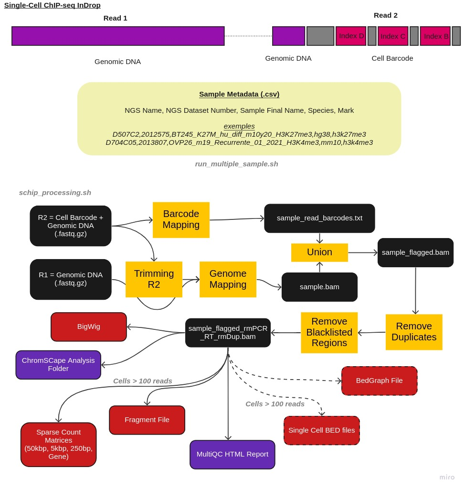

# Single-cell ChIP-seq pipeline

This data engineering pipeline is designed to treat single-cell chromatin Immuno-Precipitation 
sequencing from raw reads (fastq, paired end) to exploitable count matrix.
The multiple steps involved in the pipeline are :


# Simplifed scheme of the pipeline
  
  



# The Pipeline
  
  
* **0. Creation of config file**  
* **1. Cell barcode mapping**  
* **2. Trimming**  
* **3. Genomic mapping**  
* **4. Assignation of cell barcodes to mapped read**  
* **5. Removal of Reverse Transcription (RT) & Polymerase Chain Reaction (PCR) duplicates**  
* **6. Removal of reads based on window screening (if Read2 was unmapped)**  
* **7. Counting (Generation of count matrix)**  
* **8. Generation of coverage file (bigwig)**  
* **9. Reporting**  
* **10. Downstream R automatic analysis**  
  
  
# Running the Pipeline
  
```
usage : schip_processing All -f FORWARD -r REVERSE -o OUTPUT -c CONFIG [-d] [-h] [-v]


[Sub-Commands] 

	All		 Execute the entire pipeline based on CONFIG file
	
	GetConf		 [PreRun] Complete a configuration template based on the genome assembly and the design type
	
	--version : print version


---------------

All

   -f|--forward R1_READ: forward fastq file
   -r|--reverse R2_READ: forward fastq file
   -c|--conf CONFIG: configuration file for ChIP processing
   -o|--output OUTPUT: output folder
   -n|--name NAME: name given to samples
   -s|--downstreamOutput R analysis downstream output: if present, will run downstream analysis in given dir
   -u|--override : Override defined arguments (semicolon-separated (;)) from config file (i.e: 'MIN_MAPQ=0;MIN_BAPQ=10') [optional]
   [-d|--dryrun]: dry run mode
   [-h|--help]: help
   [-v|--version]: version

   
   GetConf
   
   	-T/--template : Pipeline config template
	-C/--configFile : Config description file
	-D/--designType : Design type
	-G/--genomeAssembly : Genome assembly
	-O/--outputConfig : Output config file
	-O/--mark : Histone mark : either 'h3k27me3', 'h3k4me3' or 'unbound'. 
	-B/--targetBed : Target BED file

```

## Creating the configuration file from the template :

Depending on your Bead type (Hifibio or LBC), your genomeAssembly (hg38, mm10), your bed target file.

Example : 

```bash 
cd ~/GitLab/ChIP-seq_single-cell_LBC_PAIRED_END_3.4/
ASSEMBLY=hg38
OUTPUT_CONFIG=/data/tmp/pprompsy/results/CONFIG_LBC
MARK=h3k27me3
TARGET_BED=/data/users/pprompsy/Annotation/bed/hg38.G5k.bed

./schip_processing.sh GetConf --template  CONFIG_TEMPLATE --configFile species_design_configs.csv --designType LBC --genomeAssembly ${ASSEMBLY} --outputConfig ${OUTPUT_CONFIG} --mark ${MARK} --targetBed ${TARGET_BED}


```
  
### Running the pipeline on a single sample :
  
```bash 

OUTPUT_DIR=/data/tmp/pprompsy/results/test
DOWNSTREAM_DIR=/data/tmp/pprompsy/results/
NAME=test
READ1=/data/users/pprompsy/tests/A1082C1.R1.fastq.gz
READ2=/data/users/pprompsy/tests/A1082C1.R2.fastq.gz

./schip_processing.sh All -f ${READ1} -r ${READ2} -c ${OUTPUT_CONFIG}  -o ${OUTPUT_DIR} --name ${NAME} -s ${DOWNSTREAM_DIR}

```


### Authors

Authors - Pacôme Prompsy (pacome.prompsy@curie.fr), Nicolas Servant
date - 20th September 2022


